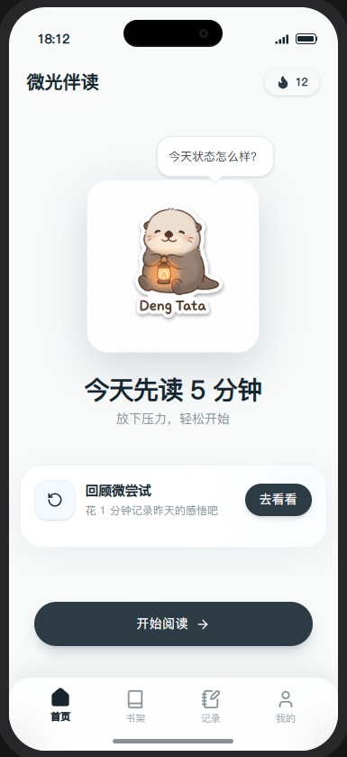
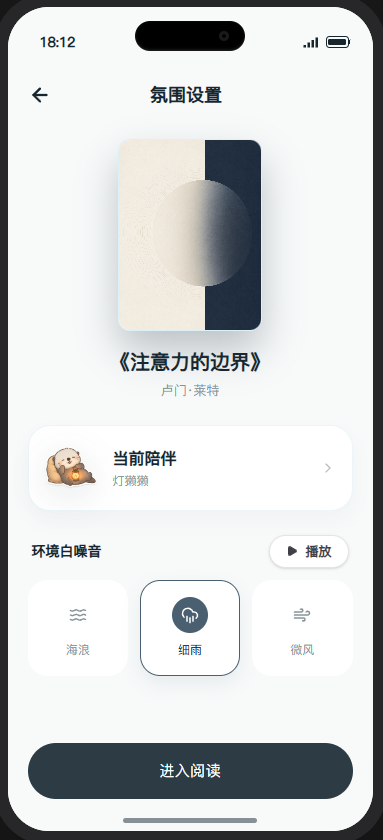
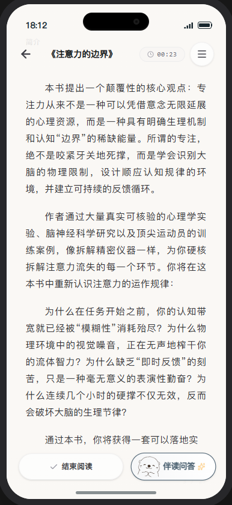
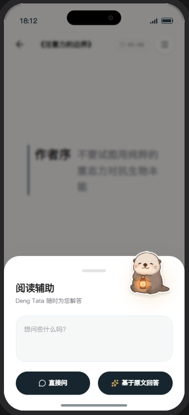
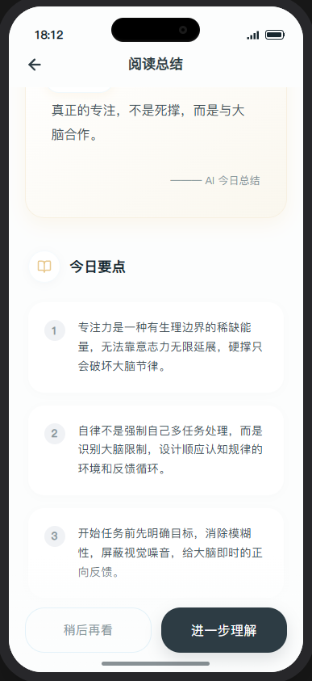
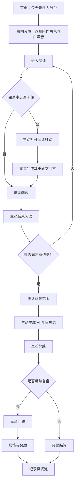

# 微光伴读 / Glimmer Reader

微光伴读是一款面向阅读启动困难、但有强烈自我提升需求的年轻人的沉浸式 AI 阅读陪伴+阅读习惯养成产品。

它不试图替用户“快速读完书”，而是用极低的启动阻力，让用户轻松开始阅读；在阅读中通过 AI 宠物提供用户主动触发的提问解释辅助，帮助用户保持阅读心流；在阅读后再通过 AI 总结、可选复盘和宠物反馈，帮助用户读懂一点、记住一点、甚至运用一点，并且第二天还愿意回来。

## 项目目标

微光伴读希望帮助阅读启动困难的用户，把“读完一本硬核书”的长期压力，拆成每天先读 5 分钟的低负担行动。

产品通过 AI 宠物陪伴用户完成阅读中的轻量理解辅助，以及阅读后的总结、复盘和行动延续，让用户在不被高压打卡驱动的情况下，逐步读懂、记住并运用阅读内容。

第一版目标是跑通一条完整、稳定、可演示的核心链路：从开始阅读，到阅读中轻量 AI 提问辅助，再到读后主动触发 AI 总结、可选复盘和宠物成长反馈。

## 项目当前阶段

当前项目处于 V0.1 作品集 Demo / 可交互原型阶段，重点验证完整用户旅程、AI 主动触发规则、低压力反馈和奖励闭环。

当前版本仍定义为 `V0.1 作品集 Demo / 可交互原型`，不直接称为 MVP。技术上已经为用户主动触发的“AI 今日总结”和阅读辅助“直接问”接入可切换的真实 DeepSeek API；作品集演示默认使用稳定 mock，需要验收真实能力时再通过本地环境变量手动切换 live。

当前真正的高保真 React 原型位于 `apps/glimmer-reader-prototype`。后续页面 UI 修改、高保真交互调整和作品集演示截图，均以这个目录为准。

## Prototype Preview

<p align="center">
  
  
  
  
  
</p>

<p align="center">
  <sub>Home · Atmosphere Settings · Reading Session · Reading Assist · Daily Summary</sub>
</p>

## Core User Flow



下一步推进顺序：

1. 以 `apps/glimmer-reader-prototype` 的 React 原型为当前高保真实现基准，继续打磨首页、书架、阅读氛围、沉浸阅读、阅读总结、三道问题、反馈、奖励结算和行动复盘等核心链路。
2. 当前高保真原型、AI 本地代理和作品集演示截图均以该目录为准，后续页面 UI、交互细节和 AI 体验验证也围绕该目录推进。
3. 完成 React 原型浏览器截图复核后，再把高保真网页用于作品集截图、面试演示和外部测试。
4. 继续验证已接入的 AI 今日总结和直接问，并在“基于原文回答”规范确认后再接入该节点的真实生成。

## 差异化机会

微光伴读不把自己定位成完整数字书库，也不和通用 AI 工具比拼总结能力。

已有产品分别解决了阅读入口、AI 总结、知识管理、专注陪伴或游戏化激励等局部问题。微光伴读更聚焦的是一个完整但低压力的阅读习惯闭环：先让用户愿意开始读 5 分钟，再在卡住时主动向 AI 提问，读后主动查看总结和可选小问题，最后通过宠物正反馈形成第二天回来的理由。

它的核心差异不是“让 AI 替用户快速读完书”，而是让 AI 在用户真实阅读的前后提供轻量帮助，降低理解和复盘成本。

## 核心 Demo

V0.1 作品集 Demo 聚焦一条完整阅读链路：

1. 用户从首页开始阅读，或在书架 / 阅读氛围页选择内置示例书；真实导入书籍作为后续方向，不进入当前 Demo 主流程。
2. 今日任务只要求先读 5 分钟。
3. 阅读前可在灯獭獭、云团、椰子、鸥漫漫中选择陪伴角色，并可选择雨声、风声或海浪声；默认角色为灯獭獭，默认白噪音为海浪声。阅读中可在阅读辅助弹窗切换白噪音，系统自动记录阅读时间和分页阅读位置。
4. 阅读中保留 AI 宠物轻量提问入口，用户可以主动输入问题，请求解释当前内容。
5. 5 分钟完成后只给轻提示，不打断用户继续阅读。
6. 用户主动结束阅读后，如果未满 5 分钟或本次阅读范围少于 4 页，App 只在阅读页内提示继续读一会儿再总结。
7. 满足条件后，用户先确认本次阅读范围，再看到 AI 宠物已经准备好帮你总结今天的阅读内容。
8. 用户主动点击查看时，才进入 AI 今日总结流程；当前原型默认使用稳定 mock，也可在本地手动切换到真实 DeepSeek 生成。
9. 阅读结束页提供“立即查看总结”和“生成稍后看”，首次流程不提供直接跳过总结入口。
10. 当用户看完 AI 总结后，可进一步选择进入下一步复盘；如果选择“稍后再看”，首页小任务卡保留“查看总结”入口，不转成问题待办。
11. 进入“问题”页后，用户可提交答案或稍后回答；如果从首页小任务卡“复盘待完成”入口再次进入，返回按钮会弹窗确认“稍后回答”或“跳过问题”，页面不重复显示稍后入口。
12. 首页的昨日行动复盘、查看总结和复盘待完成入口合并为同一张小任务卡；默认展示行动待复盘，有多个任务时用卡片底部圆点和左右滑动切换。
13. 奖励按阅读、总结、小问题和行动复盘的完成状态结算：只完成阅读就发阅读奖励；完成阅读和总结就发阅读奖励加总结奖励；完成阅读、总结和三个小问题就发阅读、总结和小问题奖励；完成行动复盘后再发行动复盘奖励。稍后查看总结或稍后回答问题时，先结算当前已完成部分，后续完成后再补发对应奖励。
14. 用户完成有效阅读并确认范围后，记录页生成当日阅读内容记录卡，默认展示阅读范围摘要；查看总结、查看习题、查看行动和显示全部都在记录页内展开，并且对应视图都会保留阅读内容本身。问题内容只有完成反馈后才显示；跳过保护开启时，跳过总结或跳过问题后可在记录页展开“查看全部”后看到继续总结 / 继续回答的后悔入口。
15. 宠物获得成长反馈，并通过首页小任务卡或记录页的行动复盘入口，引导用户第二天轻量回看行动效果。

## 阅读中 AI 辅助原则

阅读中 AI 辅助不是替用户读书，而是在用户卡住时提供轻量解释，减少跳出 App 查询造成的心流中断。

第一版 Demo 只保留 AI 宠物提问入口和模拟回答，用户可以选择使用，也可以完全不使用。阅读中 AI 辅助不自动弹出、不主动生成问题、不强制触发，也不影响阅读奖励结算。

## AI 总结原则

AI 总结不是强制作业，也不会在阅读结束后自动消耗 token。

AI 总结和理解/提炼/行动三个小问题是两个步骤。

用户点击“立即查看总结”或“生成稍后看”后，产品才进入 AI 今日总结流程。当前原型默认使用 mock，也可在本地安全切换到真实 DeepSeek 生成；首次流程不提供直接跳过总结入口。

用户看完总结后，才询问是否进入理解/提炼/行动三个小问题的复盘。如果用户选择“生成稍后看”，先保存总结并回到奖励结算，首页小任务卡保留“查看总结”入口；如果用户在总结页选择“稍后再看”，也回到首页并继续在小任务卡中保留查看总结入口，不立刻追问小问题。等用户选择进入下一步复盘后，再生成三道问题，并在完成小问题后发放相应奖励。

如果用户从首页“查看总结”待办再次进入总结页并在返回确认弹窗中选择“跳过总结”，系统会移除该待办并停止生成三个小问题；此时总结已经生成。问题页的“跳过问题”也只在从首页待办再次进入后的返回确认弹窗中出现。跳过总结、跳过问题或稍后回答问题都没有惩罚。

## 评估方式

Demo 阶段不追求大样本增长数据，重点验证用户是否能理解并走通核心链路。建议先用 3-5 名目标用户做可用性测试，观察：

- 用户是否能顺利开始 5 分钟阅读；
- 用户是否理解阅读中 AI 需要主动触发；
- AI 解释是否帮助用户回到原文，而不是替用户读书；
- AI 今日总结和三个小问题是否像帮助复盘，而不是像作业；
- 宠物和奖励是否提供正向反馈，而不是制造压力。

后续进入更接近真实验证的阶段时，再通过埋点和 AI 评估观察开始阅读率、5 分钟完成率、提问后继续阅读率、总结查看率、三个小问题完成率、次日行动复盘率、用户压力感评分和单次有效沉淀 token 成本。

## 关键文档

- [一页项目概览](portfolio/01-one-page-overview.md)：适合快速了解项目定位、核心工作、验证结果和当前边界。
- [AI 产品案例](portfolio/02-ai-product-case.md)：说明用户问题、AI 功能取舍、模型调用链路和产品验证过程。
- [PRD 摘要](portfolio/03-prd-summary-for-interview.md)：用面试阅读成本更低的方式概括 V0.1 范围。
- [用户验证记录](portfolio/06-user-validation-notes.md)：记录 3 位目标用户测试反馈和产品洞察。
- [AI 评测与 Bad Case](portfolio/07-ai-evaluation-and-bad-cases.md)：记录直接问、今日总结的评测样例、问题归因和修正策略。
- [产品指标与评价体系](portfolio/13-product-metrics-and-evaluation.md)：说明如果继续验证，会重点观察哪些产品指标和 AI 质量指标。

## 仓库结构

```text
.
├── README.md
├── apps/
│   └── glimmer-reader-prototype/
│       └── README.md
└── portfolio/
    ├── assets/
    │   └── screenshots/
    ├── 01-one-page-overview.md
    ├── 02-ai-product-case.md
    ├── 03-prd-summary-for-interview.md
    ├── 06-user-validation-notes.md
    ├── 07-ai-evaluation-and-bad-cases.md
    └── 13-product-metrics-and-evaluation.md
```

## 当前状态

- 产品定位：已完成
- 竞品分析：已完成
- PRD：已完成
- 用户旅程与 Demo / MVP 边界：已完成
- 阅读中 AI 提问辅助：已完成设计
- AI 总结触发流程：已完成设计
- 指标与 AI 评估：已完成
- Prompt 与结构化输出设计：已完成
- 高保真原型：当前以 `apps/glimmer-reader-prototype` 下的 React 原型为准
- 真实 AI API 接入：AI 今日总结和直接问已支持本地 mock / live 切换；基于原文回答暂时保留 mock、schema 和扩展边界

## 注意事项

- Demo 第一版优先使用预设 AI 输出，保证核心体验可以稳定展示。
- 真实 AI API 已用于 AI 今日总结和直接问的本地可切换验收；作品集演示默认仍使用 mock，避免接口波动影响主链路。
- 仓库不会包含 API Key，也不会上传有版权风险的完整书籍内容。
